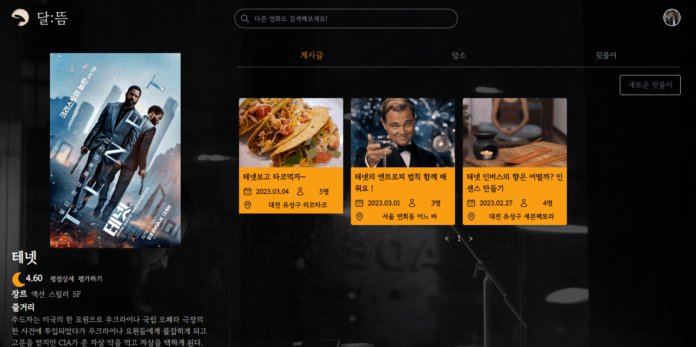

# 🌕 달뜸
## 🌙 달뜨다 <br>
-  가라앉지 않고 들썽거리다.
-  열기가 올라서 진정하지 못하다.

---
## ⏳ 프로젝트 진행 기간
- 2023.01.3(화) ~ 2023.02.17(금)  
- SSAFY 8기 2학기 공통프로젝트 - 달뜸
</br>

---
## 😋 달뜸 - 배경
누구나 한번쯤 인생영화를 보고 달뜨신 경험 있으시죠?<br>
그때 같은 영화를 본 친구가 없다거나, 감정을 공유할 마땅한 곳이 없지 않나요? <br>
영화를 보고 타인과 공감할 서비스 "달뜸"을 만들게 되었습니다.<br>
달뜸과 함께 달뜬 감정을 공유해보세요.

---
## 🧐 달뜸 - 개요

*- 영화를 보고 달뜬 당신, 
그 마음 그대로 달뜸으로 가져오세요
 -*  

영화를 보고 달뜬 감정을 공유할 수 있는 웹 서비스입니다. 간단한 생각을 주고 받을 수 있는 채팅 기능, 복잡한 생각을 정리할 수 있는 게시글 기능, 영화와 관련된 활동을 함께할 수 있는 뒤풀이 기능으로 이루어진 영화 커뮤니티 서비스입니다.


---
## 📯 주요 기능

1️⃣ 영화 리뷰 게시글

- 영화를 보고, 달 뜬 나의 생각을 게시글로 작성해요.
- 영화에 대한 다른 사람들의 생각들을 공유해요.
- 사용자들은 게시글에 댓글로 자신의 의견을 낼 수 있어요.

2️⃣ 뒤풀이 개설 및 참여

- 영화 주제에 맞는 뒤풀이를 개설하고 참여해요.
- 마음이 맞는 사람들끼리 온/오프라인 뒤풀이를 생성해요.

3️⃣ 담소
- 같은 생각을 가진 사람들끼리 실시간으로 채팅을 통해 담소를 나눠요.
- 담소에 늦게 참여해도 이전 채팅방 내역을 확인할 수 있어요.

4️⃣ 영화 평점
- 달뜸만의 영화 평점 기능으로 평점을 제공해요.
- 영화를 보고 온 어느 사용자든 영화 평점을 남길 수 있습니다.


---
## 🎨 주요 기술

**FrontEnd**
- React
- Tailwind
- SockJS
- STOMP

**Backend**
- Springboot 2.7.8
- Spring Data JPA
- WebSocket
- MySQL 8.0
- Redis
- Redis Sentinel

**CI/CD**
- AWS EC2
- Jenkins
- NGINX
- SSL
- Docker
- Docker Compose

**협업툴**
- Git
- Jira
- Notion

---
## 👷‍♂️ 프로젝트 파일 구조

```
BackEnd
 ┣ pjt1 (Bussiness)
 ┃  ┣ commons
 ┃  ┣ configuration
 ┃  ┣ util
 ┃  ┣ redis
 ┃  ┣ image
 ┃  ┣ board
 ┃  ┣ debate
 ┃  ┣ movie
 ┃  ┣ party
 ┃  ┗ rating
 ┣ pjt2 (Auth)
 ┃  ┣ configuration
 ┃  ┣ util
 ┃  ┗ member
 ┗ pjt3 (Chatting)
    ┣ commons
    ┣ configuration
    ┣ util
    ┣ redis
    ┣ member
    ┣ movie
    ┗ debate

FrontEnd
 ┣ api
 ┣ assets
 ┃ ┗ img
 ┣ components
 ┃ ┣ common
 ┃ ┣ community
 ┃ ┃ ┣ board
 ┃ ┃ ┣ movie
 ┃ ┃ ┣ party
 ┃ ┃ ┗ talk
 ┃ ┣ main
 ┃ ┣ profile
 ┃ ┃ ┣ board
 ┃ ┃ ┣ log
 ┃ ┃ ┣ party
 ┃ ┃ ┗ profile
 ┃ ┣ search
 ┃ ┗ user
 ┣ feature
 ┃ ┣ reducer
 ┃ ┗ UI
 ┣ pages
 ┣ App.css
 ┣ App.js
 ┣ App.test.js
 ┣ index.css
 ┣ index.js
 ┣ reportWebVitals.js
 ┣ setupTests.js
 ┗ store.js
 ```

---
## 🤼‍♂️ 팀원 역할 분배


---
## 👏 프로젝트 산출물
### 결과물

-  [달뜸](http://3.35.149.202/)

### Docs
-  [서비스 기획서](https://www.notion.so/10060a5fedfe44a7aae0b016f46850c1?pvs=4)
-  [디자인컨셉 기획서](https://www.notion.so/1670e30fe7cd482b90279b42ec003507?pvs=4)
-  [기능 명세서](https://www.notion.so/d77662c21b244091ba3b8f554236bb8a?pvs=4)
-  [API 명세서](https://www.notion.so/API-68b0b8dfecb34b4aaafe785eada86e2f)
-  [와이어프레임](https://www.figma.com/file/l1XPbprkPe3BKyQv0gtYWf/%EB%8B%AC%EB%9C%B8?node-id=26%3A2&t=uU8UC8beHTwlBAd8-0)
-  [컨벤션](https://www.notion.so/Git-Jira-d4ae9c584b684afda03c0edd251e231b?pvs=4)
-  [컴포넌트 설계](https://www.notion.so/7d861cf3bd46432fb82c74a3638e773b?pvs=4)
-  [ERD](https://www.notion.so/ERD-d41b654f3eb84e69b833e9ea7cd71028?pvs=4)
-  [아키텍처 설계](https://www.notion.so/2980c1f77c4a4c3fb090ae672fd15a0d?pvs=4)

-  [UCC](https://youtu.be/xCnSZqayal8)

---
## 😎 달뜸 서비스 화면

### 1️⃣ 회원가입
- 첫 로그인 시 회원정보(닉네임, 선호 장르)을 선택


### 2️⃣ 로그인
- 카카오 소셜 로그인
- 마이페이지
    - 북마크 및 작성한 게시글 / 참여신청 및 주최한 뒤풀이
    - 회원 정보 수정 (닉네임, 선호장르, 프로필 이미지)


### 3️⃣ 영화 검색
- 달뜸의 시작페이지
- 보고 온 영화를 검색할 수 있다.


### 4️⃣ 게시글
- 생성, 수정
    - 이미지, 제목, 내용 값을 지정하여 뒤풀이 모집글을 생성할 수 있다.
- 상세보기
    - 글 상세보기 및 댓글을 볼 수 있는 상세보기 페이지
- 댓글
    - 대댓글 작성, 수정, 삭제 기능
- 좋아요 및 북마크


### 5️⃣ 담소
- 생성
    - 제목, 인원수, 담소주제 값을 지정하여 생성할 수 있다.
- 상세보기
    - 현재 채팅방 참여 인원 수와 참여 기능이 있는 상세보기 페이지


- 채팅
    - 영화에 대해 다른 사용자들과 채팅을 주고 받을 수 있다.


### 6️⃣ 뒤풀이
- 생성
    - 이미지, 제목, 주의사항, 모임날짜, 모임장소, 인원 수  값을 지정하여 뒤풀이 모집글을 생성할 수 있다.
- 상세보기
    - 문의, 참가신청, 신청관리를 할 수 있는 상세보기 페이지


- 문의
    - 호스트에게 문의를 남길 수 있다. 비공개 문의 가능
- 참가신청
    - 호스트에게 간단한 메시지와 함께 뒤풀이 신청을 할 수 있다.


- 참가관리
    - 호스트는 참가신청을 승인, 거절할 수 있다.
    - 승인, 승인대기, 거절 3가지 상태에 따라 구분된다.


### 7️⃣ 평점
- 영화에 5가지 분야로 평점을 매길 수 있다.
- 모든 유저들의 평점을 종합하여 보름달 지수로 활용한다.
- 평점 수정 또한 가능하다.
