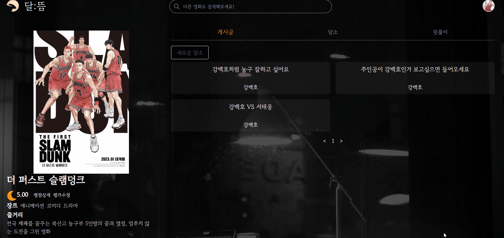
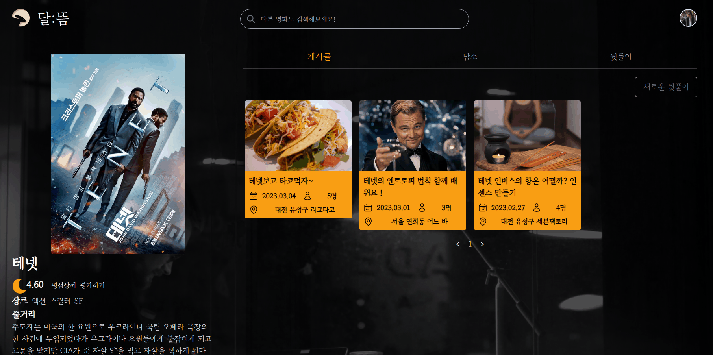
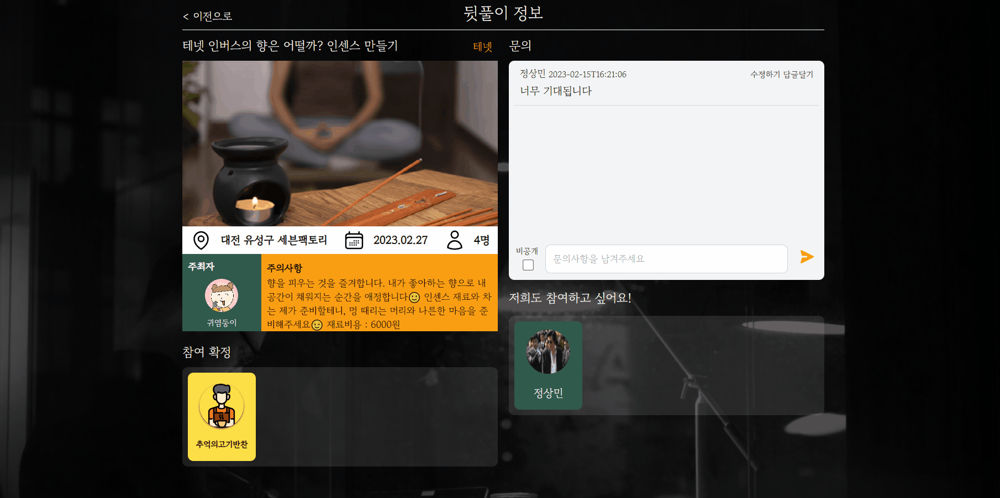
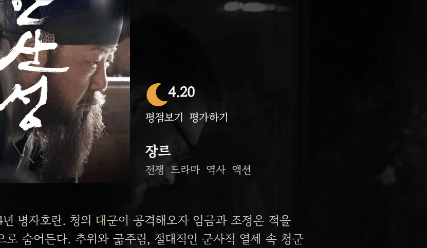

## 😎 달뜸 서비스 화면
---

### 1️⃣ 회원가입
- 첫 로그인 시 회원정보(닉네임, 선호 장르)을 선택

### 2️⃣ 로그인
- 카카오 소셜 로그인
- 마이페이지
    - 북마크 및 작성한 게시글 / 참여신청 및 주최한 뒤풀이
    - 회원 정보 수정 (닉네임, 선호장르, 프로필 이미지)

### 3️⃣ 영화 검색
- 달뜸의 시작페이지
- 보고 온 영화를 검색할 수 있다.

### 4️⃣ 게시글
- 생성, 수정
    - 이미지, 제목, 내용 값을 지정하여 뒤풀이 모집글을 생성할 수 있다.
- 상세보기
    - 글 상세보기 및 댓글을 볼 수 있는 상세보기 페이지
- 댓글
    - 대댓글 작성, 수정, 삭제 기능
- 좋아요 및 북마크

### 5️⃣ 담소
- 생성
    - 제목, 인원수, 담소주제 값을 지정하여 생성할 수 있다.
- 상세보기
    - 현재 채팅방 참여 인원 수와 참여 기능이 있는 상세보기 페이지

- 채팅
    - 영화에 대해 다른 사용자들과 채팅을 주고 받을 수 있다.

### 6️⃣ 뒤풀이
- 생성
    - 이미지, 제목, 주의사항, 모임날짜, 모임장소, 인원 수  값을 지정하여 뒤풀이 모집글을 생성할 수 있다.
- 상세보기
    - 문의, 참가신청, 신청관리를 할 수 있는 상세보기 페이지

- 문의
    - 호스트에게 문의를 남길 수 있다. 비공개 문의 가능
- 참가신청
    - 호스트에게 간단한 메시지와 함께 뒤풀이 신청을 할 수 있다.

- 참가관리
    - 호스트는 참가신청을 승인, 거절할 수 있다.
    - 승인, 승인대기, 거절 3가지 상태에 따라 구분된다.

### 7️⃣ 평점
- 영화에 5가지 분야로 평점을 매길 수 있다.
- 모든 유저들의 평점을 종합하여 보름달 지수로 활용한다.
- 평점 수정 또한 가능하다.
